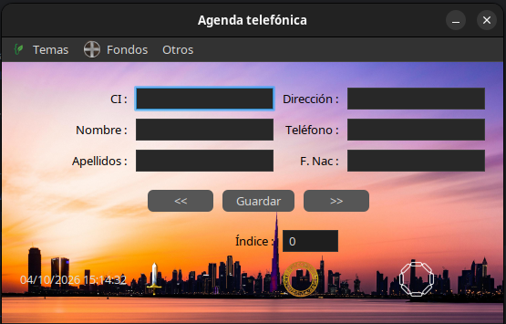
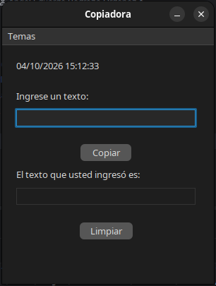

# Curso-TC-Java


> **Estos son un conjunto de proyectos en Java usando Swing, con énfasis en FlatLaf y MigLayout.**

---

## Tecnologías

- **Java 25**
- **Swing** para las interfaces
- **FlatLaf** para los temas visuales
- **MigLayout** para organizar los componentes

## Proyectos

| Proyecto | Descripción                                                                        | Lo que muestra de Swing |
|---|------------------------------------------------------------------------------------|---|
| **Sopa de Palabras** | Juego de sobre encontrar palabras en una sopa de letras (One Piece / Shadow Slave) | Botones con animación, bloqueo de controles, paneles anidados, `JOptionPane` |
| **Agenda telefónica** | Formulario de contactos con navegación                                             | Cambio de Look and Feel, fondos intercambiables, reloj en vivo, menús |
| **Copiadora de texto** | Copia lo escrito a otro campo y permite limpiarlo                                  | Reloj en vivo, cambio de tema, manejo de eventos |

---

## Sopa de Palabras (proyecto destacado)


### Cómo se juega

1. Los 8 botones (4 de **One Piece** y 4 de **Shadow Slave**) cambian a rojo uno tras otro, segundo a segundo.
2. Al pulsar uno, los demás se bloquean y aparece una sopa de letras.
3. El botón pondrá a su lado su nombre, el cual deberá buscar en la sopa de letras.
4. La palabra que representa el ícono y el nombre del botón aparece una cantidad de veces, **en cualquier sentido y dirección**.
5. Escribes cuántas veces crees que aparece y pulsas **Comprobar**.
6. Se muestran los resultados, y **Reset** reinicia el juego.

### Detalles de la interfaz

- Varios paneles organizados para que todo quede ordenado (clase `DesafíoNavideño`).
- Menú **Creador**: muestra un `JOptionPane` con el autor.

> **El principal reto de este juego fue organizar bien todos los paneles y sus componentes en el Frame. Ya que apilarlo
> todo en un solo panel no mostraba resultados satisfactorios. Para lograr que los botones cambiaran de color segundo a 
> segundo usé: javax.swing.Timer porque era la opción más segura y correcta (ejecuta el código del ActionListener 
> automáticamente en el EDT). Las sopas de letras son Strings en un JTextField que tiene su propio panel. Si lo 
> rehiciera hoy, aplicaría más opciones con hilos.**  

> **El origen del nombre viene de un reto navideño de un curso de Java.**

---

## Agenda telefónica



Formulario de contactos (CI, nombre, apellidos, dirección, teléfono y fecha de nacimiento) con navegación entre 
registros mediante `<<` y `>>` y un campo de índice.

**Los contactos se guardan solo en memoria:** al cerrar la aplicación se pierden.

**Lo que muestra de Swing:**

- **Temas:** cambia el Look and Feel entre `FlatLaf Light`, `FlatLaf Dark`, `FlatLaf IntelliJ`, `FlatLaf Darcula`, 
`FlatMacLight`, `FlatMacDark`, `System (Swing)`, `Nimbus`, `Metal` y `Motif`.
- **Fondos:** Predeterminado (Ciudad), Mar, Fitness Mujer, Fitness Hombre, Atardecer, Río y Perros.
- **Otros:** Creador y Salir.
- Fecha y hora mostradas en pantalla.

---

## Copiadora de texto



Escribes un texto, **Copiar** lo muestra en el campo inferior y **Limpiar** borra ambos. Incluye fecha y hora en 
pantalla y menú de **Temas** para cambiar el Look and Feel. Es el más sencillo ya que fue el primero.

---

## Pruebas técnicas

> **En el proyecto se presentan 2 pruebas técnicas sencillas: 'AdministrarEstacionamiento' y ''SistemaDeAsientos'.**

---

## Cómo ejecutarlo

**Requisitos:** JDK 25 y un IDE como IntelliJ IDEA.

1. Clona el repositorio:
   ```bash
   git clone https://github.com/TrueLantier/Curso-TC-Java-Principiantes.git
   ```
2. Ábrelo en tu IDE.
3. Ejecuta el método `main` del proyecto que quieras probar.

<!--

> **[ESCRIBE TÚ] Nombre de la clase `Main` de cada proyecto**, o la ruta exacta, para que quien clone sepa cuál ejecutar.

### Dependencias

FlatLaf y MigLayout se agregaron **manualmente** (todavía no usaba Maven cuando hice estos proyectos).

> **[ESCRIBE TÚ] Versiones exactas de FlatLaf y MigLayout** y de dónde las bajaste. En IntelliJ: *File > Project Structure > Libraries*.

---

## Qué aprendí

> **[ESCRIBE TÚ] 3 a 5 viñetas.** Piensa en lo que descubriste de Swing, de los Look and Feel, de MigLayout y de organizar el código en capas. Mejor lo concreto ("aprendí a no bloquear el hilo de la interfaz") que lo genérico ("aprendí mucho").

## Próximos pasos

- Una pestaña de inicio para elegir a qué proyecto ir (hoy se ejecuta desde `main`).

> **[ESCRIBE TÚ] Agrega lo que realmente planees.** Por ejemplo, migrar a Maven o añadir persistencia a la agenda. Solo si lo vas a hacer.

---

## Autor

> **[ESCRIBE TÚ] Tu nombre, GitHub y el contacto que quieras mostrar.**

## Créditos

Los personajes e íconos de *One Piece* y *Shadow Slave* pertenecen a sus respectivos creadores. Se usan aquí con fines educativos.

> **[REVISA] Origen de los íconos y fondos.** Si algunos no son tuyos, indica la fuente aquí.
