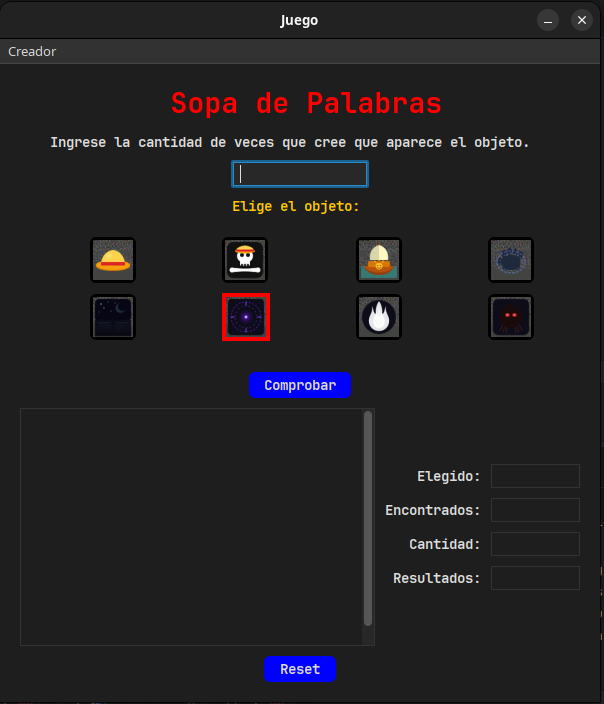
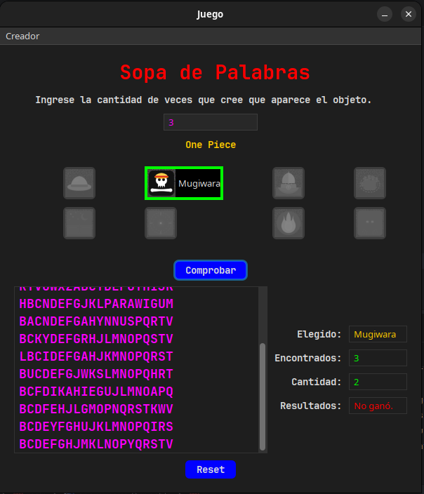

# Curso-TC-Java-Principiantes


> **[ESCRIBE TÚ] Descripción corta (2 frases).**
> Pregúntate: si se lo explicas a alguien que no programa, ¿qué es este repo y para qué lo hiciste?
> Pista: lo que dijiste a mí fue que el objetivo es *mostrar cosas hechas en Swing con FlatLaf y MigLayout*.

---

## Tecnologías

- **Java 25**
- **Swing** para las interfaces
- **FlatLaf** para los temas visuales
- **MigLayout** para organizar los componentes

## Proyectos

| Proyecto | Descripción | Lo que muestra de Swing |
|---|---|---|
| **Sopa de Palabras** | Juego de apuestas sobre una sopa de letras (One Piece / Shadow Slave) | Botones con animación, bloqueo de controles, paneles anidados, `JOptionPane` |
| **Agenda telefónica** | Formulario de contactos con navegación | Cambio de Look and Feel, fondos intercambiables, reloj en vivo, menús |
| **Copiadora de texto** | Copia lo escrito a otro campo y permite limpiarlo | Reloj en vivo, cambio de tema, manejo de eventos |

---

## Sopa de Palabras (proyecto destacado)




### Cómo se juega

1. Los 8 botones (4 de **One Piece** y 4 de **Shadow Slave**) cambian a rojo uno tras otro, segundo a segundo.
2. Al pulsar uno, los demás se bloquean y aparece una sopa de letras.
3. La palabra que representa el ícono y el nombre del botón aparece una cantidad de veces, **en cualquier sentido y dirección**.
4. Escribes cuántas veces crees que aparece y pulsas **Comprobar**.
5. Se muestran los resultados, y **Reset** reinicia el juego.

### Detalles de la interfaz

- Varios paneles organizados para que todo quede ordenado (clase `DesafíoNavideño`).
- Menú **Creador**: muestra un `JOptionPane` con el autor.

> **[ESCRIBE TÚ] El reto técnico de este juego.** Guía de preguntas:
> - ¿Cómo logras que los botones cambien de color cada segundo sin congelar la ventana? (¿`javax.swing.Timer`, un hilo? ¿por qué esa opción?)
> - ¿Cómo colocas la palabra en cualquier dirección dentro de la cuadrícula sin que se pisen unas con otras?
> - ¿Qué fue lo más difícil, y qué cambiarías si lo rehicieras hoy?
>
> Escríbelo en primera persona, 3 a 5 líneas. Esto es lo que más va a leer un reclutador.

> **[ESCRIBE TÚ] Cuéntame el origen del nombre `DesafíoNavideño`** si quieres que aparezca (¿fue un reto navideño?). Si no aporta, bórralo.

---

## Agenda telefónica


Formulario de contactos (CI, nombre, apellidos, dirección, teléfono y fecha de nacimiento) con navegación entre registros mediante `<<` y `>>` y un campo de índice.

**Los contactos se guardan solo en memoria:** al cerrar la aplicación se pierden.

**Lo que muestra de Swing:**

- **Temas:** cambia el Look and Feel entre `FlatLaf Light`, `FlatLaf Dark`, `FlatLaf IntelliJ`, `FlatLaf Darcula`, `FlatMacLight`, `FlatMacDark`, `System (Swing)`, `Nimbus`, `Metal` y `Motif`.
- **Fondos:** Predeterminado (Ciudad), Mar, Fitness Mujer, Fitness Hombre, Atardecer, Río y Perros.
- **Otros:** Creador y Salir.
- Fecha y hora mostradas en pantalla.

---

## Copiadora de texto


Escribes un texto, **Copiar** lo muestra en el campo inferior y **Limpiar** borra ambos. Incluye fecha y hora en pantalla y menú de **Temas** para cambiar el Look and Feel.

---

## Pruebas técnicas

> **[ESCRIBE TÚ] Una o dos líneas.** Por ejemplo, el nombre de cada prueba (como `PruebaCapas`) y de qué trataba. Solo mención breve.

---

## Cómo ejecutarlo

**Requisitos:** JDK 25 y un IDE como IntelliJ IDEA.

1. Clona el repositorio:
   ```bash
   git clone https://github.com/TrueLantier/Curso-TC-Java-Principiantes.git
   ```
2. Ábrelo en tu IDE.
3. Ejecuta el método `main` del proyecto que quieras probar.

> **[ESCRIBE TÚ] Nombre de la clase `Main` de cada proyecto**, o la ruta exacta, para que quien clone sepa cuál ejecutar.

### Dependencias

FlatLaf y MigLayout se agregaron **manualmente** (todavía no usaba Maven cuando hice estos proyectos).

> **[ESCRIBE TÚ] Versiones exactas de FlatLaf y MigLayout** y de dónde las bajaste. En IntelliJ: *File > Project Structure > Libraries*.

---

## Qué aprendí

> **[ESCRIBE TÚ] 3 a 5 viñetas.** Piensa en lo que descubriste de Swing, de los Look and Feel, de MigLayout y de organizar el código en capas. Mejor lo concreto ("aprendí a no bloquear el hilo de la interfaz") que lo genérico ("aprendí mucho").

## Próximos pasos

- Una pestaña de inicio para elegir a qué proyecto ir (hoy se ejecuta desde `main`).

> **[ESCRIBE TÚ] Agrega lo que realmente planees.** Por ejemplo, migrar a Maven o añadir persistencia a la agenda. Solo si lo vas a hacer.

---

## Autor

> **[ESCRIBE TÚ] Tu nombre, GitHub y el contacto que quieras mostrar.**

## Créditos

Los personajes e íconos de *One Piece* y *Shadow Slave* pertenecen a sus respectivos creadores. Se usan aquí con fines educativos.

> **[REVISA] Origen de los íconos y fondos.** Si algunos no son tuyos, indica la fuente aquí.
